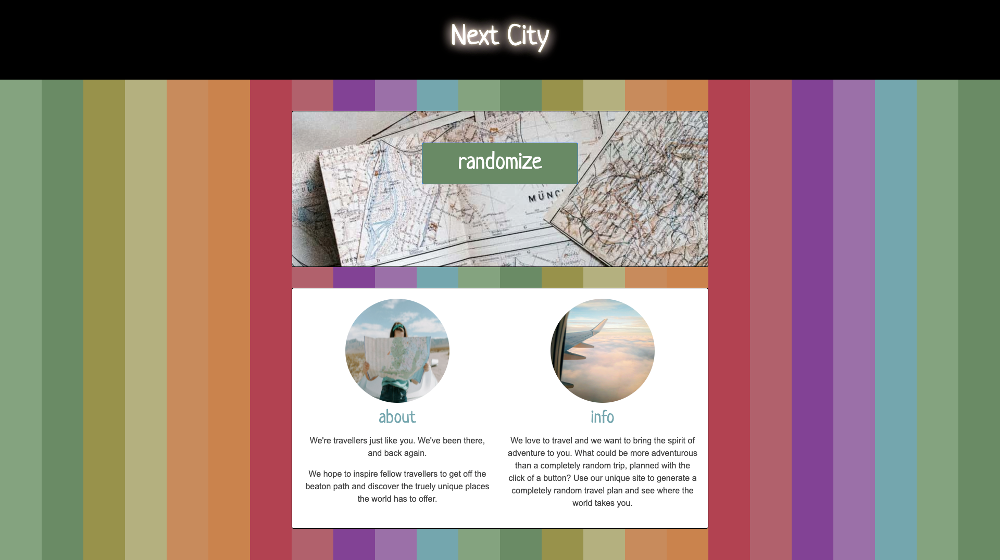
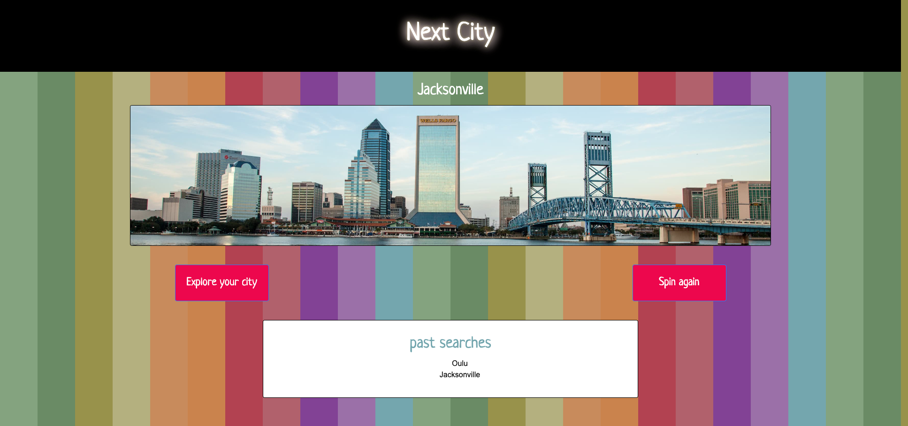
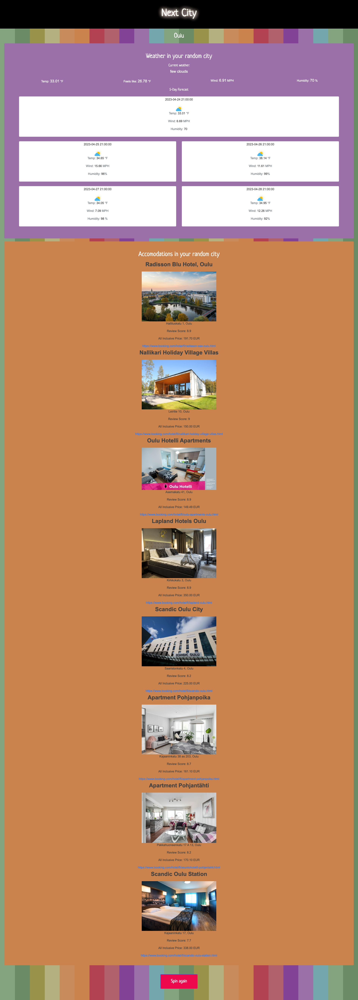

# Project One | NEXT CITY

## Description

The group developed a website geared toward travel lovers. The purpose of the site is to generate interest in travel by randomly selecting a travel location for the visitor. 

We used API connections to generate a random city, then connect the random city to a weather API to show the upcoming forcast for that location, and to a hotel booking API to explore hotel options in the city.

- the user clicks "randomize" in order to generate a random city selection
- a page displays to show the random city selection and an image of the city
- the user can choose to explore the city, or return to generate another random choice
- the user can also view past searches if they have randomized more than once
- after selecting "explore" for the random city, the user can view the upcoming weather forcast and explore a list of potential hotel bookings for that location

## Usage

File can used and shared to for knowledge expansion or usage as needed. 

## Credit

APIs:

booking.com (https://developers.teleport.org/api/resources/UrbanArea/)
Urban Area Resource (https://developers.teleport.org/api/resources/UrbanArea/)
Open Weather (https://openweathermap.org/api)
Stock Photos (https://www.pexels.com/)

## License

- GitHub repository URL: https://github.com/cherah-petra/CP-Code-Quiz-C04
- GitHub Page: https://cherah-petra.github.io/CP-Code-Quiz-C04/
- License: license.txt

